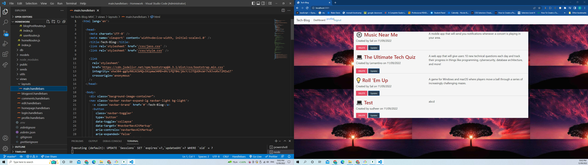
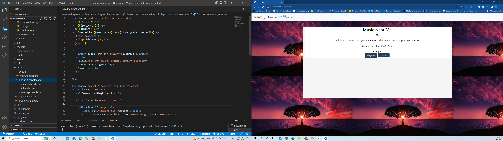
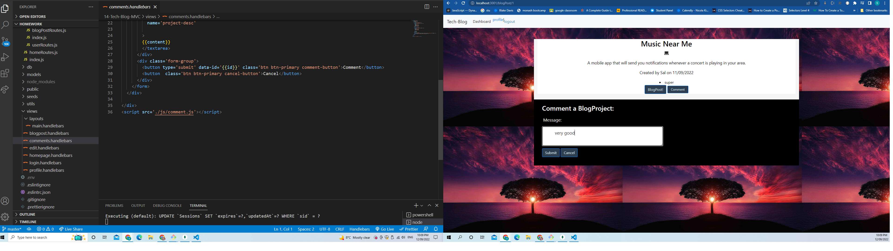
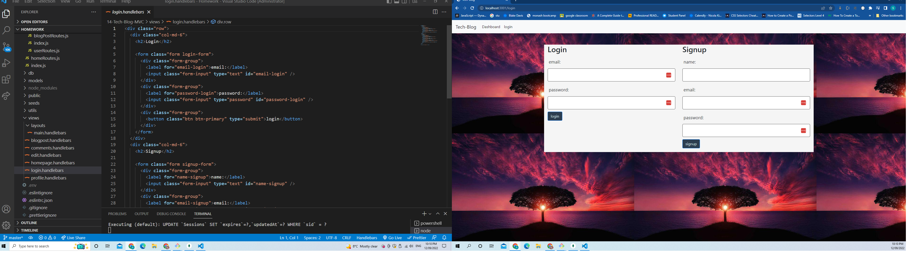
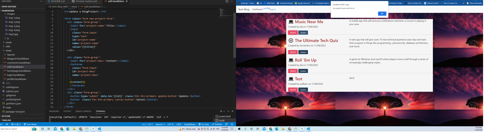
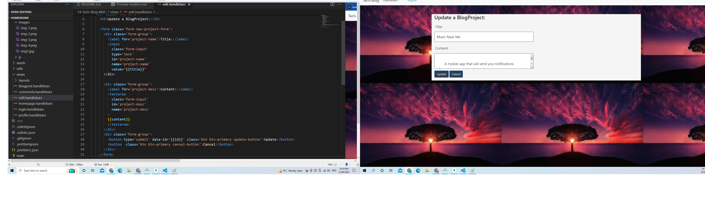
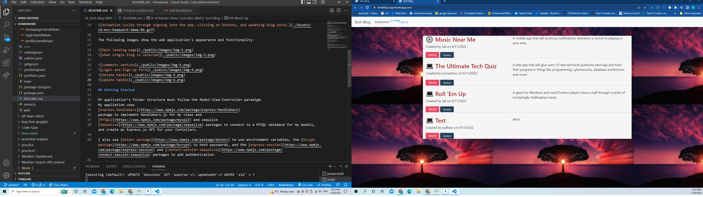

# 14 Model-View-Controller (MVC): Tech Blog

## Your Task

My task this week is to build a CMS-style blog site similar to a Wordpress site, where developers can publish their blog posts and comment on other developers’ posts as well. You’ll build this site completely from scratch and deploy it to Heroku. Your app will follow the MVC paradigm in its architectural structure, using Handlebars.js as the templating language, Sequelize as the ORM, and the express-session npm package for authentication.

## User Story

```md
AS A developer who writes about tech
I WANT a CMS-style blog site
SO THAT I can publish articles, blog posts, and my thoughts and opinions
```

## Mock-Up

The following images show the web application's appearance and functionality:

</br>
</br>

</br>
</br>
</br>
</br>


## Getting Started

MY application’s folder structure must follow the Model-View-Controller paradigm.
My appliation uses
[express-handlebars](https://www.npmjs.com/package/express-handlebars)
package to implement Handlebars.js for my views and
[MYSQL2](https://www.npmjs.com/package/mysql2) and sequlize
[Sequelize](https://www.npmjs.com/package/sequelize) packages to connect to a MYSQL database for my models, and create an Express.js API for your Contollers.

I also use [dotenv package](https://www.npmjs.com/package/dotenv) to use environment variables, the [bcrypt package](https://www.npmjs.com/package/bcrypt) to hash passwords, and the [express-session](https://www.npmjs.com/package/express-session) and [connect-session-sequelize](https://www.npmjs.com/package/connect-session-sequelize) packages to add authentication.

I also installed nodemon to make up updates lot easier.

### required dependencices
In order to be able to run the app after being cloned you need to run, using node
```
npm i
```
Once node is installed, log in to mysql and run the following commands to initiate the database:
```
source db/schema.sql
```
Then to populate seed data and run it the application you can use
```
npm run seed
node server.js
```
Install nodemon and run the application
```
npm run listen
```


## deploymnet

[heroku](https://techiblog-app.herokuapp.com/)</br>
[github repo](sudheer313/14-Tech-Blog-MVC)</br>
[github link](https://github.com/sudheer313/14-Tech-Blog-MVC)</br>

## credits

askBCS </br>
referred week14-mvc mini project

## What I learned

This application helped me to understand basic MVC structure and also routes structure in mvc pattern
I also learned to how to define controllers and handlebars
I also understood concept of Authorization and Authentication. I also came across session storage.

## Challanges

At start I was unable to understand contollers. I was unbale to figure out about back-end and front-end routes at start. But after careful understanding of concepts this helped me to congigure this app.
I am also thankful to BCS who helped me through the process when I was struck in the due process of execution.

## Author

@Sudheer Kandula
